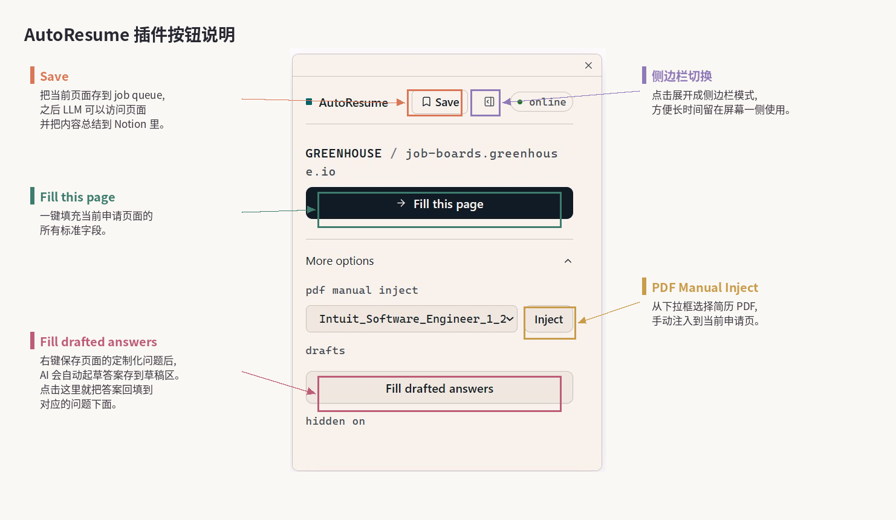
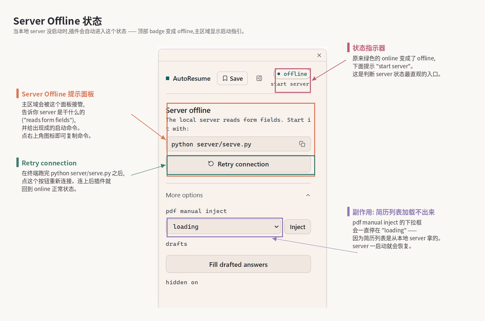
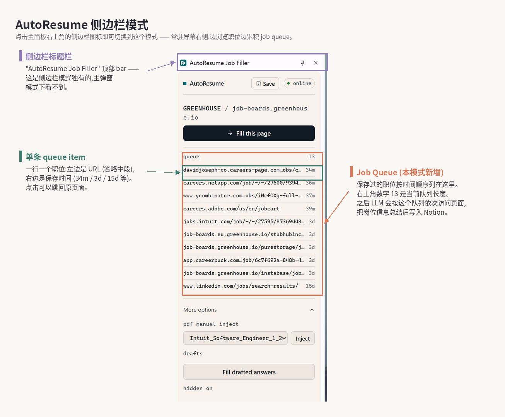

# ResumeAuto

Job-search + resume tailoring + auto-apply pipeline. Driven by [Claude Code & Cowork](https://docs.claude.com/en/docs/claude-code) — **no extra API keys to wire up**. No plans to support other LLMs for now.

> 中文版: [README.md](README.md)

## How it works

Three phases:

1. **Collect** — Claude Code searches LinkedIn / Greenhouse / Indeed and similar platforms for fresh postings that match your profile, and writes the qualifying ones to a Notion database. (That's the ideal. In practice, having Claude do the discovery itself is still too slow right now, so the recommended flow is: collect jobs manually, hit Save to drop them into the queue, then let Claude Cowork chew through the queue and write everything into Notion. Better discovery approaches are still being explored.)
2. **Tailor** — For each job, Claude Code reads the JD from Notion, picks the best 2 projects from your library, rewrites bullets to match JD keywords, and compiles a 1-page ATS-friendly PDF.
3. **Apply** — A Chrome extension auto-fills Workday / Greenhouse / Lever / Ashby forms and uploads the tailored PDF. For open-ended questions, right-click to queue the question; later have Claude Cowork drain the queue and the extension fills the answers back into the page. You can also try driving the extension via Claude Cowork directly, but that path is currently slow and token-heavy.

## Sample

Open [examples/demo_resume.pdf](examples/demo_resume.pdf) — a pre-compiled 1-page PDF tailored against the bundled sample JD ([examples/sample_jd.md](examples/sample_jd.md)). You don't need LaTeX or Claude Code to look at it; it's just here so you can see the kind of output this tool produces before installing anything.

## Extension UI

The main panel looks like this — clicking the AutoResume icon in the Chrome toolbar pops it up in the top-right corner of the current page.



The button you'll hit most is **Fill this page** in the middle, which fires off a one-shot fill for every field on the current application page that the extension can identify. The **Save** button at the top right is for when you're on a LinkedIn listing or a company careers page and spot a job you want to apply to: click it once, and the URL gets dropped into the job queue so you can have the LLM batch-process everything later and push it into Notion. The icon right next to Save switches to side-panel mode (more on that below), which is handier when you're working through applications for a long stretch. Expanding **More options** lets you manually pick a PDF from the dropdown and inject it into the current page's resume upload field; or hit **Fill drafted answers** to splash the open-ended answers you queued earlier (via the right-click "Ask Agent to draft an answer" context menu) back into their corresponding form fields.

If the local server isn't running, the extension drops into offline state, which looks like this:



The green `online` chip at the top flips to `offline`, and the main area surfaces a panel explaining what the server is for (it reads form fields) and the start command `python server/serve.py` shown directly — the icon next to it copies the command. Once you've got the server running in a terminal, hit **Retry connection** and you'll be back online in a couple seconds. One side effect worth knowing: while offline, the PDF dropdown shows "loading" forever — that list comes from the local server, so it recovers the moment the server does.

Side-panel mode is the other way to use the extension, and it's better suited for long batch sessions:



Once you switch over, **Job Queue** lists every URL you've ever queued via Save. The intended use is to just tell Claude Cowork "go through everything in the queue" — it'll open tabs, read the JDs, and write them into Notion on its own.

## Requirements

- Python 3.9+
- A LaTeX distribution — [MiKTeX](https://miktex.org/) on Windows, [TeX Live](https://www.tug.org/texlive/) on Linux/macOS
- Chrome (for the Phase 3 extension)
- [Claude Code](https://docs.claude.com/en/docs/claude-code) installed and signed in
- *(Optional but recommended)* Notion + an integration token, if you want to use Notion as the job source

> On the Claude Code subscription: Claude Max (~$100/mo) is the recommended tier — at the volume of automated tailoring this tool drives, it's more than enough headroom. If you're not applying at high volume, the $20 Pro tier should also work (probably?).

## Quickstart

```bash
# 1. Clone and install Python deps
git clone <this-repo>
cd ResumeAuto
pip install -r requirements.txt

# 2. (Optional) Smoke test — produces a deterministic 1-page PDF from
#    the bundled sample JD, just to confirm your LaTeX install is good.
#    No Claude Code or user_data/ needed.
python pipeline/run_pipeline.py --demo
#    On success you'll see output/Demo_Distributed_Systems_Engineer_<date>.pdf.
#    The tailoring is pre-computed (see examples/sample_jd.md and
#    examples/sample_tailored.json). Real LLM-driven tailoring on your
#    own JDs starts at step 3.

# 3. Import your existing resume (PDF or DOCX) — populates user_data/ +
#    templates/example.tex in one shot. Open Claude Code in the project
#    directory and ask:
#       "import my resume from ~/Downloads/my_resume.pdf"
#    See prompts/resume_import.md for the full flow.
#    (Or skip the import and copy from examples/ manually:
#       cp examples/personal_info.example.json   user_data/personal_info.json
#       cp examples/project_library.example.json user_data/project_library.json
#     then edit both files and templates/example.tex by hand.)

# 4. Start the local server (the Chrome extension talks to it)
python server/serve.py

# 5. In a second terminal, load the Chrome extension:
#    chrome://extensions → Developer mode → Load unpacked → select ./extension

# 6. Open Claude Code in the project directory. It auto-loads CLAUDE.md and
#    is ready to orchestrate. Try:
#       "tailor my resume for this job: <paste JD>"
```

## Project layout

```
ResumeAuto/
├── CLAUDE.md           # Orchestration spec — Claude Code auto-loads this
├── README.md           # this file (Chinese)
├── README.en.md        # English version
├── pipeline/           # Resume compile pipeline (Python)
│   ├── run_pipeline.py # JSON in → 1-page PDF out
│   └── agent.py        # Helper functions for the orchestrator
├── templates/
│   └── example.tex     # LaTeX template with %%% PLACEHOLDER %%% markers
├── prompts/            # LLM instructions and agent prompts
│   ├── prompt_rules.md   # Rules for the resume-tailoring step
│   ├── form_rules.md     # Rules for Phase 3 form filling
│   └── job_collection.md # Prompt for the Phase 1 job-discovery agent
├── server/             # Local HTTP bridge between agent and Chrome extension
├── extension/          # Chrome extension (Phase 3 auto-fill)
├── examples/           # Reference templates — copy from here into user_data/
└── user_data/          # YOUR data — gitignored, never committed
```

## Configuring `user_data/`

`user_data/` is gitignored. Anything in there stays local — `git status` will not show it, and `git add .` will not pick it up.

Two files you maintain:

- **`user_data/personal_info.json`** — name, contact info, education, work history, work-authorization defaults. Read by the local server and used for Phase 3 form filling.
- **`user_data/project_library.json`** — your projects with `tags`, a one-line `summary`, and LaTeX-formatted `bullets`. The agent picks 2 projects per job based on tag overlap with the JD. Keep at least 3–5 projects so there's selection room.

Easiest path: run the resume import flow (Quickstart step 3). It populates both files and updates the template heading / Education / Experience sections from your existing PDF or DOCX.

Manual path: copy from `examples/`, then edit. Both example files have a `_instructions` field at the top with a quick guide.

The pipeline's runtime state files (`pending_jobs.json`, `pending_questions.json`, `pending_answers.json`, `autofill_state.json`, `tab_tracker.json`) also live in `user_data/`. The server creates them on first write — you don't need to seed them.

## Configuring the resume template

Edit `templates/example.tex`:

- Replace the **heading** (name, phone, email, LinkedIn, GitHub).
- Replace the **Education** section.
- Replace the **Professional Experience** section.
- **Do not touch** the `%%% PROJECTS_PLACEHOLDER_START/END %%%` and `%%% SKILLS_PLACEHOLDER_START/END %%%` markers. The pipeline injects tailored content between them on every run.

The template ships with an "Alex Doe" demo persona that compiles to a valid 1-page PDF as a sanity check.


## Optional: Notion as the job source

If you use Notion to track jobs, set these before invoking the agent:

```bash
export NOTION_DB_ID="<your database UUID>"
export NOTION_DATA_SOURCE="collection://<uuid>"
```

The expected Notion schema (field names, status options, JD page-body format) is documented in `prompts/job_collection.md`. The first time you run, you can ask Claude Code to create the database for you with the right schema.

If you don't want Notion, the easiest no-database alternative is a `user_data/jobs.md` file with one `## Company - Title` block per job; you'd then adapt `prompts/job_collection.md` to read from there. (A CSV/markdown source adapter is not yet built into the pipeline — contributions welcome.)

## Privacy

- Your `user_data/`, `output/`, `work/`, and `logs/` folders are gitignored. Audit `git status` before committing.
- The Chrome extension reads ATS form fields and `user_data/personal_info.json` over `127.0.0.1:8765`. It makes no outbound calls beyond that.
- Claude Code reads your JDs, project library, and personal info as part of the orchestration loop.

## Caveats

- LaTeX is a heavy install. MiKTeX and TeX Live are multi-GB. We're exploring lighter resume-generation paths (e.g. pure HTML/CSS).
- The Chrome extension has dedicated adapters for Workday, Greenhouse, Lever, and Ashby. Other ATSes fall back to a best-effort generic fill.
- This is a solo-maintained project, so there will be bugs and rough edges. If you find something worth improving, issues and PRs are very welcome.

## Note

If the configuration feels like too much, you can just hand the relevant info to Claude and let it set the project up for you end-to-end. Modern Claude Code is more than capable of handling this.